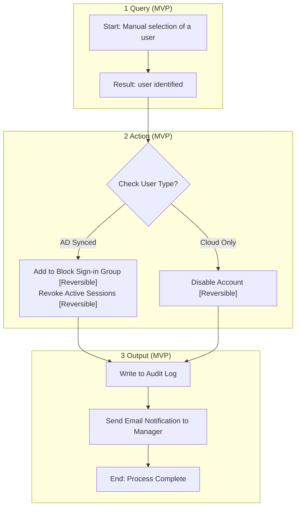

```mermaid
graph TD
    subgraph "1 Query (MVP)"
        A[Start: Manual selection of a user] --> B[Result: user identified];
    end

    subgraph "2 Action (MVP)"
        B --> C{Check User Type?};
        C -- "AD Synced" --> D["Add to Block Sign-in Group [Reversible]<br/>Revoke Active Sessions [Reversible]"];
        C -- "Cloud Only" --> E["Disable Account [Reversible]"];
    end

    subgraph "3 Output (MVP)"
        D --> F[Write to Audit Log];
        E --> F;
        F --> G[Send Email Notification to Manager];
        G --> H[End: Process Complete];
    end
```