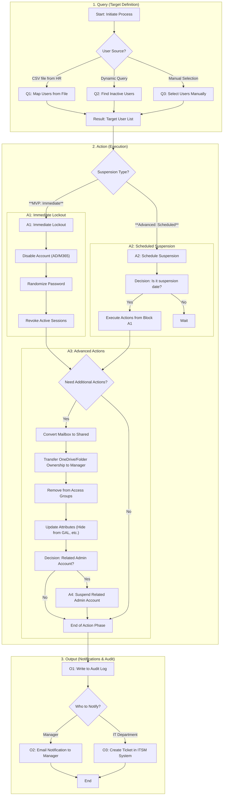

# AN Example of Graph Usage

```mermaid
graph TD
    subgraph "1. Query (Target Definition)"
        A[Start: Initiate Process] --> B{User Source?};
        B -- "CSV file from HR" --> C[Q1: Map Users from File];
        B -- "Dynamic Query" --> D[Q2: Find Inactive Users];
        B -- "Manual Selection" --> E[Q3: Select Users Manually];
        C --> F[Result: Target User List];
        D --> F;
        E --> F;
    end

    subgraph "2. Action (Execution)"
        F --> G{Suspension Type?};
        G -- "**MVP: Immediate**" --> H[A1: Immediate Lockout];
        G -- "**Advanced: Scheduled**" --> I[A2: Schedule Suspension];

        subgraph "A1: Immediate Lockout"
            H1["Disable Account (AD/M365)"]
            H2[Randomize Password]
            H3[Revoke Active Sessions]
            H --> H1 --> H2 --> H3
        end

        subgraph "A2: Scheduled Suspension"
            I --> J[Decision: Is it suspension date?];
            J -- "Yes" --> K[Execute Actions from Block A1];
            J -- "No" --> L[Wait];
        end

        H3 --> M{Need Additional Actions?};
        K --> M;

        subgraph "A3: Advanced Actions"
            M -- "Yes" --> N[Convert Mailbox to Shared];
            N --> O["Transfer OneDrive/Folder Ownership to Manager"]
            O --> P[Remove from Access Groups];
            P --> Q["Update Attributes (Hide from GAL, etc.)"]
            Q --> R[Decision: Related Admin Account?];
            R -- "Yes" --> S[A4: Suspend Related Admin Account];
            R -- "No" --> T_OUT;
            S --> T_OUT;
        end

        M -- "No" --> T_OUT[End of Action Phase];

    end

    subgraph "3. Output (Notifications & Audit)"
        T_OUT --> U[O1: Write to Audit Log];
        U --> V{Who to Notify?};
        V -- "Manager" --> W[O2: Email Notification to Manager];
        V -- "IT Department" --> X[O3: Create Ticket in ITSM System];
        W --> Y[End];
        X --> Y;
    end
```
