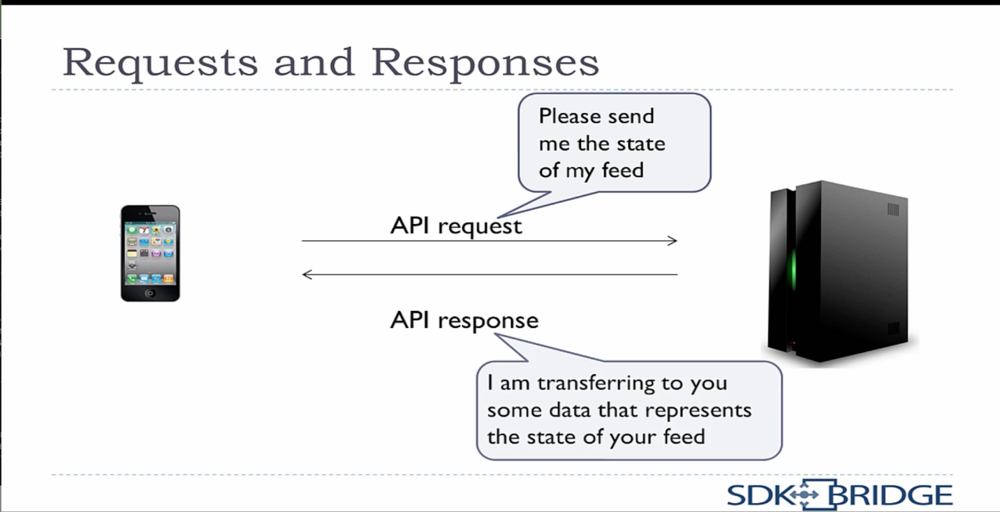

# Learn API Technical Writing: REST

**REST** – **RE**presentational **S**tate **T**ransfer

REST is a category of Web APIs

**Requests and Responses**


**Authentication and Authorisation**

* Client device must prove identity to the server.
* Authentication
  * Username and password
* Authorization
  * Use token
  * Authority to make a request
* OAuth: one of the most common authorisation platforms*


## Introduction – What is REST?

* **RE**presentational **S**tate **T**ransfer
* It is a type of web API
* REST has several features
* Design pattern, not a protocol*

Design pattern vs protocol

A protocol is a pattern you need to fit exactly. For example, USD: size of plug, number of pins etc. 
A design pattern is a set of guidelines. For exampe, a house design that can be modernist, victoria, etc.

<mark> Rest is a Design Pattern </mark>

* Guidelines to follow, but they are not strict.
* Some APIs follow guidelines more closely than others.
* Because it is a design pattern, many people call APIs that use REST as "RESTful APIs".

**History**

* Previous web API styles required a lot of information being passed back and forth.
* REST proposed by [Roy Fielding](https://en.wikipedia.org/wiki/Roy_Fielding). It is simpler and more flexible.
* REST in its pure form is highly flexible, but not always easy to use.
* Most RESTful APIs do not follow the pure design pattern.

### Requests and Responses



### HTTP

Like all web APIs, REST uses HTTP (HyperText Transfer Protocol) to send messages.

* An HTTP address is a URL, just like for web pages.
* HTTP has different "verbs" it can use: GET, POST, DELETE, etc.
* Secure HTTP (https) is also an option.

### Resources defined in the URL

* A resource is a piece of data that represents something
* If you are making a request about users, then the URL should have the word "users" in it.
* For example, the URL to return all users might be: http:/api.example.com/users
* The URL can contain IDs to narrow information
* For example, the URL to return information about user with ID 12345 might be: http:/api.example.com/users/12345

### Formats

One of the REST features is that it is completely independent of the format. The data sent and returned can be of any format. JSON is the most common; XML is also widely used. Can be media types, like images, sound files, etc.

### Stateless

REST is stateless. In this case, "stateless" means that the server does not keep track of the state of the device. For example, pagination with "Load more" button in the web pages and browser keeps track and do all the math.

### SOAP comparison

SOAP is the **S**imple **O**bject **A**ccess **P**rotocol. 
* Previously the most common web API. 
* Not actually all that simple.
* XML only.
* Protocol instead of a design pattern. Thus, the design had to follow strict standards.

### Review

* REST is a type of web API
* It is a design pattern, not a protocol
* It has requests and responses
* Resourced are defined in the URL
* It uses HTTP to send messages
* It can use any data format
* It does not keep track of the device's state


## Requests

A simple HTTP request looks like:

```json

POST http://api.example.com/user?source=ios&device=iphone

Accept: application/json
Content-type: application/json

{
  "name": "Aleks Mashanski",
  "email": "maszanski@yahoo.com"
}

```

### The Anatomy of the Request

* POST – method
* URL – http://api.example.com/user
* Query parameters – ?source=ios&device=iphone
* Headers – in our case, Accept and Content-type. There are standard headers to use for HTTP requests
* Body – in the {}. Only have a body for POST and PUT

#### Method

Method is the action that you are taking.

Examples

* **GET:** Return data from the server
* **POST:** Create a new resource on the server
* **DELETE:** Delete a resource from the server
* **PUT**

#### URL

URL stands for Uniform Resource Locator. Comes with the server information.

#### Query parameters

* Usually contains information on how the data should be returned
* Key/value pairs
* You can sometimes see these in browser address bars
* Example: 
  * http://api.example.com/user?sort-name&dir=ascend
  * Query parameters used to say: "Return sorted by name in ascending order."

## Resources

A resource represents a data concept. For example:
* Learning Management System (LMS).
  * Teatcher, student, course, assignment
* Flight Reservation System
  * Airline, passenger, flight, ticket
* Restaurant Review System
  * Restaurant, user, review, menu
  
### Resources and URLs

In REST, the resource is defined in the URL. THis means URL contains singular nouns. For example:
* http://api.example.com/restaurants
* http://api.example.com/courses/39314
* http://api.example.com/airlines/984289/flight

#### Speifying one or more resources

* Resource objects that exist have an ID
* Use IDs in the URL to specify a particular resource object
* If no ID – To get data on all restaurants:
  * GET http://api.example.com/restaurants
* To get data the restaurant with ID = 93839
  * GET http://api.example.com/restaurants/93839

### Endpoints

An endpoint means the URL for a resource
Examples:
* http://api.example.com/restaurants
* http://api.example.com/courses/{course-id} – *endpoint*
* http://api.example.com/airlines/{airline-id}/flight

### Resources can contain resources

* You can have a hierarchy of resources
* For example, airlines have flights that are specific to them
* To get all flights for the airline with ID = 53239:
  * GET http://api.example.com/airlines/53239/flight
* To get data on the flight 457 for that airline:
  * http://api.example.com/airlines/53239/flight/457

### Review

* A resources represents a data concept
* Resources are specified in the URL
* Use IDs to specify one particular resource object
* Resources can be containe din other resources


## HTTP methods

* As part of the HYperText Transfer Protocol, there are different types of requests:
  * If you type an address into a browser, that is a GET
  * If you fill out a form in a browser, that is a POST

### What can you do with a resource? (CRUD)

* **C**reate – POST
* **R**etrieve – GET
* **U**pdate – PUT
* **D**elete – DELETE

What is an HTTP method?

CRUD

GET

POST

PUT

(TBD)

## Query parameters

## Headers

## Authentication and Authorisation

## Responses

## API Reference Documentation

## Tools