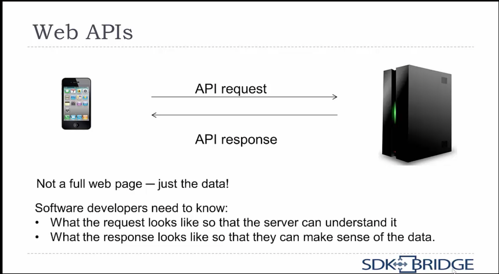

# Learn API Technical Writing: JSON and XML

API – Application Programming Interface

SDK – Software Development Kit (what developer need to write API)

## Introduction

### API Overview

* API – Application Programming Interface
* It defines how two pieces of software talk to each other
* In this learning material, we are focusing on Web APIs
  
  

First Web API has been created by eBay

* APIs allow developers to create apps that "mash up" data from different sources
* Example: you want to create an app that show how to get to the nearest patk
  * The city provides an API that says where all the parks are
  * Google Maps provides and API that says how to get to a given location
  * Your app calls them both.
  
ProgrammableWeb showed the number of public API (deprecated).

What makes API documentation different than end user documentation?
* Youare writing for a developer audience
* The documentation is very text-based

### What is JSON and XML?

Two types of structured data
* Structured data doesn't fit into a table. It mostly looks like tree with all of the branches it has.

XML – older, still used

JSON – simpler, less text, more popular for new APIs

## Data Types and Structured Data

In programming, data can have certain types:

* Integer numbers
* Decimal numbers
* Text
* True/false
* Dates
* Custom types

In additional to individual data types, structured data can have groups of data, called **Collections**.
* Arrays (lists). They have:
  * A size (how many are in the list)
  * An order (which object comes first)
* Dictionaries (look up tables). A dictionary is a collection of data keys and values. You can use key to look up the value. For example, Distionary of US regions (keys) and number of states in that region (values). *"West":6, "North East":10, "South":8, "Midwest":10*

Json has three types:
* Number
* String – a number of text characters "strung" together. 
  * Enclosed in double or single quotation marks
  * Can have letters, numbers, punctuation, etc.
  * Can have spaces
* Boolean – true or false. Any checkbox is a boolean value.
  
XML has one type:
* String

Structured data combines data types and collections.
You can have:
* Dictionaries of lists
* List of dictionaries
* Dictionaries of dictionaries
* Etc. as many levels you need

Thus, the structured data can be a very complex tree of data.

API responses *almost always* have structured data
API requests *sometimes* have structurted data

(TBD) 

## What are APIs?

## Why are they important?

## What is structured data?

## Two common data formats: JSON and XML

## Tools