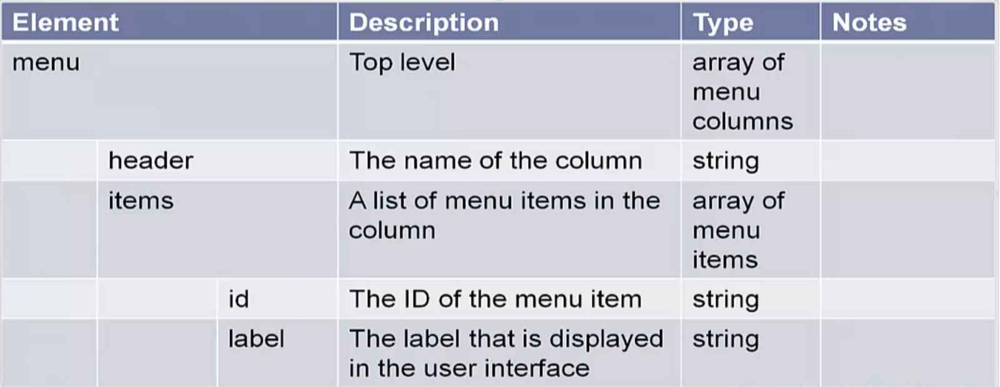
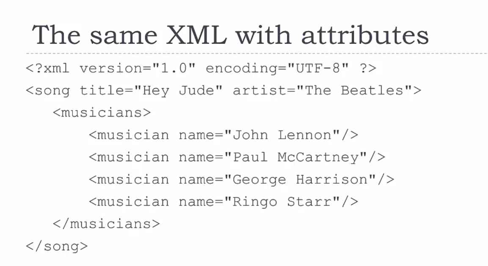

# Learn API Technical Writing: JSON and XML

API – Application Programming Interface

SDK – Software Development Kit (what developer need to write API)

## Introduction

### API Overview

* API – Application Programming Interface
* It defines how two pieces of software talk to each other
* In this learning material, we are focusing on Web APIs
  
  

First Web API has been created by eBay

* APIs allow developers to create apps that "mash up" data from different sources
* Example: you want to create an app that show how to get to the nearest patk
  * The city provides an API that says where all the parks are
  * Google Maps provides and API that says how to get to a given location
  * Your app calls them both.
  
ProgrammableWeb showed the number of public API (deprecated).

What makes API documentation different than end user documentation?
* Youare writing for a developer audience
* The documentation is very text-based

### What is JSON and XML?

Two types of structured data
* Structured data doesn't fit into a table. It mostly looks like tree with all of the branches it has.

XML – older, still used

JSON – simpler, less text, more popular for new APIs

## Data Types and Structured Data

In programming, data can have certain types:

* Integer numbers
* Decimal numbers
* Text
* True/false
* Dates
* Custom types

In additional to individual data types, structured data can have groups of data, called **Collections**.
* Arrays (lists). They have:
  * A size (how many are in the list)
  * An order (which object comes first)
* Dictionaries (look up tables). A dictionary is a collection of data keys and values. You can use key to look up the value. For example, Distionary of US regions (keys) and number of states in that region (values). *"West":6, "North East":10, "South":8, "Midwest":10*

Json has three types:
* Number
* String – a number of text characters "strung" together. 
  * Enclosed in double or single quotation marks
  * Can have letters, numbers, punctuation, etc.
  * Can have spaces
* Boolean – true or false. Any checkbox is a boolean value.
  
XML has one type:
* String

Structured data combines data types and collections.
You can have:
* Dictionaries of lists
* List of dictionaries
* Dictionaries of dictionaries
* Etc. as many levels you need

Thus, the structured data can be a very complex tree of data.

API responses *almost always* have structured data
API requests *sometimes* have structurted data


## JSON

JSON is an acronym JavaScript Object Notation. JSON was originally created to hold structured data to be used in JavaScript. It is used for data for all kinds of applications. It is the most popular way of sending data for Web APIs.

### Basic Data types

* Strings – enclosed in a single or double quotation marks
* Numbers – Integer or decimal, positive or negative
* Booleans – true or false; no quotation marks
* null – means "nothing"; no quotation marks
* Arrays – lists in square brackets, comma-separated and can mix data types. For example [43, "bread", false, 67, null]

#### Objects
* Objects are JSON's dicitonaries
* They are enclosed in curly brackets {}
* Keys and values are separated by a colon :
* Pairs are separated by commas
* Keys and values can be any data type

For example: {"red":209, "green":134, "blue":92}

#### Nesting
* Nesting Involves putting arrays and objects inside each other:
* You can put arrays inside objects, objects inside arrays, arrays inside objects, etc.
* Often a JSON file is one big object with lots of objects and arrays inside.

#### JSON Examples

Describing a song:
```json
{
    "song":
        {
            "title": "Hey, Jude",
            "artist": "The Beatles",
            "musicians":
                ["John Lennon", "Paul McCartney",
                    "George Harrison", "Ringo Starr"]
        }
}
```
Menu description:


### Documenting JSON

This section covers:
* Overall approach
* JSON responses
* JSON requests
* How to handle:
  * Nesting
  * Default values
  * Valid values
  * Formats

#### Description and Tables

Start with a one sentence description.
JSON details are best documented in one or more tables.
* Columns include key names, description and type
* Can also include additional information

A table for JSON Responses:

| Element | Description | Type | Notes |
|---------|-------------|------|-------|
|         |             |      |       |
|         |             |      |       |
|         |             |      |       |
|         |             |      |       |

* Element: The key of the key/value pair
* Description: A sentence fragment, usually a descriptive noun
* Type: number, string, Boolean, array or object
* Notes: Additional information

A table for JSON Requests:

| Element | Description | Type | Required | Notes |
|---------|-------------|------|----------|-------|
|         |             |      |          |       |
|         |             |      |          |       |
|         |             |      |          |       |
|         |             |      |          |       |

The difference is that there is a new column called Required
* Indicated whether you have or have not that element
* Fill with either "Required" or "Optional"
* Include deault value in Notes

#### Nesting

There are two ways to handle nesting:
* Indentation
  * Best for cases where objects are not reused
  * Takes up less space
* Table for each object type
  * Best for cases where objects are reused
  * Takes up more space

#### Example: Song JSON Documentation

Represents an API description of the song above (and below)
```json
{
    "song":
        {
            "title": "Hey, Jude",
            "artist": "The Beatles",
            "musicians":
                ["John Lennon", "Paul McCartney",
                    "George Harrison", "Ringo Starr"]
        }
}
```
  

#### Example JSON: Describing a menu

```json
{
  "menu": [
    {
      "header": "File",
      "items": [
        { "id": "Open", "label": "Open" },
        { "id": "New", "label": "New" },
        { "id": "Close", "label": "Close" }
      ]
    },
    {
      "header": "View",
      "items": [
        { "id": "ZoomIn", "label": "Zoom In" },
        { "id": "ZoomOut", "label": "Zoom Out" },
        { "id": "OriginalView", "label": "Original View" }
      ]}
  ]}

```
  

#### Example JSON: Adding a Comment

```json
{
  "comment": {
    "userId": "pgruenbaum",
    "discussionId": 964564445654,
    "time": "2015-02-28 10:04:32",
    "text": "Well said, Barbara!"
  }
}
```
**Note:** "time" is GMT and also optional. If not included, then it uses the current time when the request is received by the server.

  

#### Example JSON: Menu

  

## XML

XML – eXtensible Markup Language. Like HTML:
* Hypertext Markup Language
* Used for creating websites
* XML can be used for any kind of structured data

Tags work like HTML: starts with <...> and ends with </...>. The start and end tags must match. Tag names must only be letters, numbers and underscores. Example: 
```xml
<artist>The Beatles</artist>
```
An empty tag can also end with />

In addition to content, tags can have attributes. Attributes are key/value pairs and hold simple data (a string). Both are strings, but the keys do not have quotes. THis means they must be letters, numbers and underscores only. No spaces or puntuation characters.

In most common designs, attributes are not used for data. They are used to indicate that some property about the data (metadata) For example:
```xml
<fileSize unit="kB">34.6</fileSize>
```

### Example XML: Song



### Example XML: Describing a menu


You can pull comments into XML just like HTML. Comments start with "<! --" and end with "-->"

### Namespaces

YOu might have a tag name mena one thing in one contetx, but something else in a different context. For this, you use namespaces to uniquely identify them. The tag name has a "namespace:" prefix. For example: 
```xml
<sdkbridge:onlineCourse>
```

### Schemas

XML files can be described with a schema. The schema describes the structure of the XML file. This is called XSD file (XML Schema Definition). XSD describes what the tags, attributes, and types are.

## In Conclusion

(TBD) 