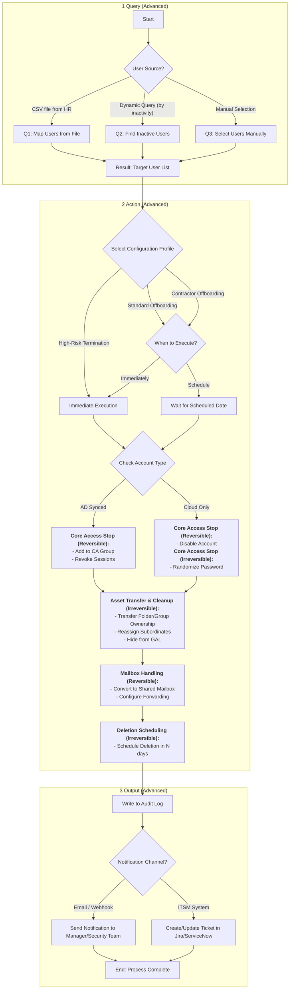

```mermaid
graph TD
    subgraph "1 Query (Advanced)"
        A[Start] --> B{User Source?};
        B -- "CSV file from HR" --> C[Q1: Map Users from File];
        B -- "Dynamic Query (by inactivity)" --> D[Q2: Find Inactive Users];
        B -- "Manual Selection" --> E[Q3: Select Users Manually];
        C --> F[Result: Target User List];
        D --> F;
        E --> F;
    end

    subgraph "2 Action (Advanced)"
        F --> G{Select Configuration Profile};
        G -- "High-Risk Termination" --> H_Immediate[Immediate Execution];
        G -- "Standard Offboarding" --> I{When to Execute?};
        G -- "Contractor Offboarding" --> I;
        
        I -- "Immediately" --> H_Immediate;
        I -- "Schedule" --> J[Wait for Scheduled Date];
        
        J --> K{Check Account Type};
        H_Immediate --> K;

        K -- "AD Synced" --> L["<b>Core Access Stop (Reversible):</b><br/>- Add to CA Group<br/>- Revoke Sessions"];
        K -- "Cloud Only" --> M["<b>Core Access Stop (Reversible):</b><br/>- Disable Account<br/><b>Core Access Stop (Irreversible):</b><br/>- Randomize Password"];

        L --> N["<b>Asset Transfer & Cleanup (Irreversible):</b><br/>- Transfer Folder/Group Ownership<br/>- Reassign Subordinates<br/>- Hide from GAL"];
        M --> N;
        
        N --> O["<b>Mailbox Handling (Reversible):</b><br/>- Convert to Shared Mailbox<br/>- Configure Forwarding"];
        O --> P["<b>Deletion Scheduling (Irreversible):</b><br/>- Schedule Deletion in N days"];
    end

    subgraph "3 Output (Advanced)"
        P --> Q[Write to Audit Log];
        Q --> R{Notification Channel?};
        R -- "Email / Webhook" --> S[Send Notification to Manager/Security Team];
        R -- "ITSM System" --> T[Create/Update Ticket in Jira/ServiceNow];
        S --> U[End: Process Complete];
        T --> U;
    end
```