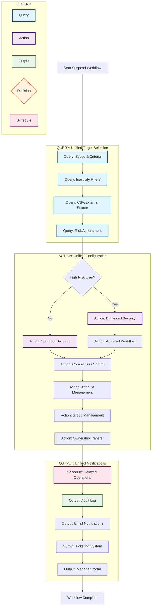

```mermaid
graph TB
    %% LEGEND
    subgraph "LEGEND"
        Q[Query]:::query
        A[Action]:::action
        O[Output]:::output
        D{Decision}:::decision
        S[Schedule]:::schedule
    end
    
    %% MAIN UNIFIED FLOW
    START[Start Suspend Workflow] --> Q1
    
    subgraph "QUERY: Unified Target Selection"
        Q1[Query: Scope & Criteria]:::query
        Q1 --> Q2[Query: Inactivity Filters]:::query
        Q2 --> Q3[Query: CSV/External Source]:::query
        Q3 --> Q4[Query: Risk Assessment]:::query
    end
    
    Q4 --> D1{High Risk User?}
    
    subgraph "ACTION: Unified Configuration"
        D1 -->|No| A1[Action: Standard Suspend]:::action
        D1 -->|Yes| A2[Action: Enhanced Security]:::action
        
        A1 --> A3[Action: Core Access Control]
        A2 --> A4[Action: Approval Workflow]
        A4 --> A3
        
        A3 --> A5[Action: Attribute Management]
        A5 --> A6[Action: Group Management]
        A6 --> A7[Action: Ownership Transfer]
    end
    
    A7 --> S1[Schedule: Delayed Operations]:::schedule
    
    subgraph "OUTPUT: Unified Notifications"
        S1 --> O1[Output: Audit Log]:::output
        O1 --> O2[Output: Email Notifications]
        O2 --> O3[Output: Ticketing System]
        O3 --> O4[Output: Manager Portal]
    end
    
    O4 --> END[Workflow Complete]
    
    classDef query fill:#e1f5fe,stroke:#01579b,stroke-width:2px
    classDef action fill:#f3e5f5,stroke:#4a148c,stroke-width:2px
    classDef output fill:#e8f5e8,stroke:#1b5e20,stroke-width:2px
    classDef decision fill:#fff3e0,stroke:#e65100,stroke-width:2px
    classDef schedule fill:#fce4ec,stroke:#880e4f,stroke-width:2px
```